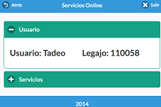

## UNIV

Sistema de información y administración de la UDA
=======
Vistas del sistema.

Servicios básicos a prestar
---------------------------

	- Información de las carreras
	- Programas de las materias
	- Situación Académica
	
Tecnologías
-----------

La API está hecha con Laravel 4. Vamos a usar este framework como base para la aplicaciónn con RESTful. Del lado cliente se utiliza JQuery-Mobile.

* [Github] - Sistema de versionado
* [Ajax] - Para conectarse en forma asíncrona
* [Laravel] - Framework de PHP
* [JQuery-Mobile] - UI responsive para móviles
* [MySQL] - Como DB, a definir 

### Editores del sistema

* Octavio Coria
* Tadeo Riveros Koloszwa

Licencia
--------
MIT

[Github]:https://github.com/
[Ajax]:https://api.jquery.com/jQuery.ajax/
[Laravel]:http://laravel.com/
[JQuery-Mobile]:demos.jquerymobile.com/1.4.2/
[MySQL]:http://www.mysql.com/products/workbench/
	
